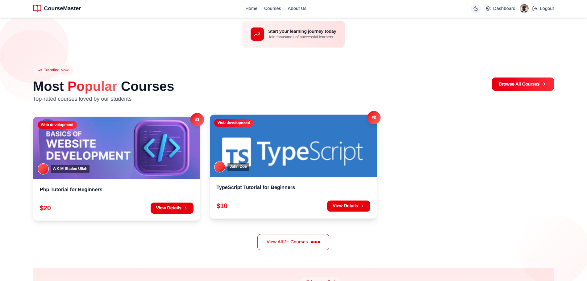

<div align="center">

<h1>
  
  CourseMaster
</h1>

### *Your Learning Journey, Simplified*

[](https://course-master-webapp.vercel.app/)
[](https://reactjs.org/)

[](https://tailwindcss.com/)

[](https://firebase.google.com/)

[](https://vitejs.dev/)

[🚀 Live Demo](https://course-master-webapp.vercel.app/) • [📋 Features](#-key-features) • [📸 Screenshots](#-screenshots)
</div>

---

## 📋 Table of Contents

- [✨ Overview](#-overview)
- [🎯 Key Features](#-key-features)
- [🛠️ Technologies Used](#️-technologies-used)
- [📸 Screenshots](#-screenshots)
- [⚙️ Installation](#️-installation--setup)
- [💪 Challenges & Solutions](#-challenges--solutions)
- [📁 Project Structure](#-project-structure)
- [📡 API Documentation](#-api-documentation)
- [🤝 Contributing](#-contributing)
- [📄 License](#-license)
---

## ✨ Overview

**CourseMaster** is a modern, full-stack EdTech platform designed to revolutionize online learning. Built with cutting-edge web technologies, CourseMaster offers a seamless experience for both students seeking knowledge and educators managing courses.

### 🌟 What Makes CourseMaster Special?

CourseMaster combines intuitive design with powerful functionality to create the ultimate learning environment. With features ranging from interactive quizzes to comprehensive course management, it provides everything needed for effective online education.

---

## 🎯 Key Features

<table>
<tr>
<td width="50%">

### 🎓 For Students

- ✅ **Course Discovery**  
  Browse and search through extensive course catalog
  
- 📚 **Interactive Learning**  
  Engage with video content and track progress
  
- ❓ **Quiz System**  
  Test knowledge with interactive quizzes
  
- 🌙 **Theme Support**  
  Switch between light and dark modes
  
- 📱 **Responsive Design**  
  Learn on any device, anywhere
  
- ⭐ **Progress Tracking**  
  Monitor learning achievements

</td>
<td width="50%">

### 👨‍🏫 For Educators

- ➕ **Course Creation**  
  Easily create and manage courses
  
- 📊 **Admin Dashboard**  
  Comprehensive analytics and insights
  
- ❓ **Quiz Management**  
  Create and manage interactive quizzes
  
- 👥 **Student Management**  
  Track student progress and engagement
  
- 📈 **Performance Insights**  
  Monitor course performance metrics
  
- ⚙️ **Content Organization**  
  Structure courses with modules and lessons

</td>
</tr>
</table>

### 🌟 Platform Highlights

| Feature | Description |
|---------|-------------|
| 🔐 **Authentication** | Secure login/signup with Firebase Authentication |
| 🎨 **Modern UI** | Beautiful interface with Tailwind CSS & Framer Motion |
| 📱 **Responsive Design** | Seamless experience across all devices |
| 🔄 **Real-time Updates** | Instant feedback and progress updates |
| 🎯 **Smart Search** | Intelligent filtering and sorting options |
| 📊 **Context API** | Efficient state management |

---

## 🛠️ Technologies Used

### Frontend Stack

<div align="center">


</div>

### Core Libraries

- **React.js 19** - Modern UI library
- **Context API** - State management
- **Tailwind CSS 4.1.17** - Utility-first CSS framework
- **daisyUI 5.5.5** - Tailwind CSS component library
- **Framer Motion** - Smooth animations
- **React Router DOM 7** - Client-side routing
- **Axios** - HTTP client
- **Lucide Icons** - Beautiful icon library
- **React Hook Form** - Form handling
- **Recharts** - Data visualization

### Integrations & Services

| Service | Purpose |
|---------|---------|
| 🔥 **Firebase** | Authentication & Hosting |
| 🗄️ **MongoDB** | Database (Backend) |
| 🚂 **Express.js** | Backend framework |

### Development Tools

```json
{
  "bundler": "Vite 7",
  "language": "JavaScript (ES6+)",
  "styling": "Tailwind CSS + Custom CSS",
  "version_control": "Git & GitHub",
  "deployment": "Firebase Hosting"
}
```

---

## 💪 Challenges & Solutions

<table>
<tr>
<th width="30%">Challenge</th>
<th width="70%">Solution</th>
</tr>
<tr>
<td>🔴 <b>State Management</b></td>
<td>✅ Leveraged React Context API for efficient global state management without overcomplicating the architecture</td>
</tr>
<tr>
<td>🔴 <b>Authentication Sync</b></td>
<td>✅ Implemented Firebase-MongoDB user synchronization for consistent user experience</td>
</tr>
<tr>
<td>🔴 <b>Role-based Access</b></td>
<td>✅ Developed custom ProtectedRoute component with role-based authorization</td>
</tr>
<tr>
<td>🔴 <b>Performance Optimization</b></td>
<td>✅ Utilized React.memo, useCallback, and lazy loading for optimal performance</td>
</tr>
<tr>
<td>🔴 <b>Responsive Design</b></td>
<td>✅ Implemented mobile-first approach with Tailwind's responsive utilities</td>
</tr>
</table>

---

## 📁 Project Structure

```
client-cm/
├── 📂 public/
│   ├── index.html
│   └── assets/
│
├── 📂 src/
│   ├── 📂 components/         # Reusable UI components
│   │   ├── layout/            # Header, footer, navbar
│   │   └── shared/            # Shared components
│   │
│   ├── 📂 context/            # React Context providers
│   │   ├── AuthContext.js     # Authentication context
│   │   └── ThemeContext.js    # Theme context
│   │
│   ├── 📂 pages/              # Main application pages
│   │   ├── courses/           # Course-related pages
│   │   ├── dashboard/         # User dashboards
│   │   ├── home/              # Homepage sections
│   │   └── quizzes/           # Quiz pages
│   │
│   ├── 📂 router/             # Routing configuration
│   │   └── router.jsx         # Route definitions
│   │
│   ├── 📂 services/           # API services
│   │   └── api.js             # API service layer
│   │
│   ├── 📂 firebase/           # Firebase configuration
│   │   └── firebase.init.js   # Firebase initialization
│   │
│   ├── App.jsx                # Main app component
│   ├── main.jsx               # Entry point
│   └── index.css              # Global styles
│
├── 📄 .env                    # Environment variables
├── 📄 .gitignore
├── 📄 package.json
├── 📄 vite.config.js          # Vite configuration
└── 📄 README.md
```

---

## 📡 API Documentation

The CourseMaster platform uses a RESTful API architecture with the following service modules:

### Base Configuration
- **Base URL**: `https://course-master-wheat.vercel.app/api`
- **Authentication**: Firebase-based authentication with custom headers
- **Content Type**: `application/json`

### API Service Modules

#### Auth API
- `syncUser(userData)` - Sync Firebase user to MongoDB
- `getUserProfile(firebaseUID)` - Get user profile by Firebase UID

#### Course API
- `getAllCourses(params)` - Get all courses with filters
- `getCourseById(courseId)` - Get single course by ID
- `createCourse(courseData)` - Create a new course
- `updateCourse(courseId, courseData)` - Update a course
- `deleteCourse(courseId, firebaseUID, email)` - Delete a course
- `getCoursesByInstructor(instructorId)` - Get courses by instructor

#### Enrollment API
- `enroll(courseId, firebaseUID, email)` - Enroll in a course
- `getMyCourses(firebaseUID, email, status)` - Get student's enrolled courses
- `getEnrollmentById(enrollmentId, firebaseUID, email)` - Get single enrollment details
- `markLessonComplete(enrollmentId, lessonIndex, firebaseUID, email)` - Mark lesson as completed
- `updateLastAccessed(enrollmentId, firebaseUID, email)` - Update last accessed
- `getEnrollmentAnalytics(firebaseUID, email, rangeDays)` - Admin: Get enrollment analytics
- `getEnrollmentsByCourse(courseId, firebaseUID, email)` - Admin: Get enrollments by course

#### Quiz API
- `createQuiz(quizData, firebaseUID, email)` - Create a quiz (admin)
- `getQuizzesByCourse(courseId, firebaseUID, email)` - Get quizzes for a course
- `getQuizById(quizId, firebaseUID, email)` - Get single quiz by ID
- `submitQuiz(quizId, answers, firebaseUID, email)` - Submit quiz answers
- `updateQuiz(quizId, quizData, firebaseUID, email)` - Update a quiz (admin)
- `deleteQuiz(quizId, firebaseUID, email)` - Delete a quiz (admin)
- `getMyResults(firebaseUID, email)` - Get student's quiz results

#### Assignment API
- `submitAssignment(data, firebaseUID, email)` - Submit an assignment
- `getMyAssignments(firebaseUID, email)` - Get student's assignments
- `getAllAssignmentsAdmin(firebaseUID, email)` - Admin: get all submitted assignments

### Authentication Headers
Most API calls require authentication headers:
- `x-firebase-uid`: Firebase UID for authentication
- `x-user-email`: Email as fallback authentication method

---
## ⚙️ Installation & Setup

### Prerequisites

Before you begin, ensure you have the following installed:

- ✅ **Node.js** (v16 or higher) - [Download](https://nodejs.org/)
- ✅ **npm** or **yarn** - Package manager
- ✅ **Git** - Version control

### 🚀 Quick Start

1️⃣ **Clone the repository**
```bash
git clone https://github.com/your-username/course-master.git
cd client-cm
```

2️⃣ **Install dependencies**
```bash
npm install
# or
yarn install
```

3️⃣ **Configure environment variables**

Create a `.env` file in the root directory:

```env
# API Configuration
VITE_API_URL=http://localhost:5000/api

# Firebase Configuration
VITE_FIREBASE_API_KEY=your_firebase_api_key
VITE_FIREBASE_AUTH_DOMAIN=your_auth_domain
VITE_FIREBASE_PROJECT_ID=your_project_id
VITE_FIREBASE_STORAGE_BUCKET=your_storage_bucket
VITE_FIREBASE_MESSAGING_SENDER_ID=your_messaging_sender_id
VITE_FIREBASE_APP_ID=your_app_id
```

4️⃣ **Start the development server**
```bash
npm run dev
# or
yarn dev
```

5️⃣ **Open your browser**

Navigate to `http://localhost:5174` 🎉

### 📦 Available Scripts

| Command | Description |
|---------|-------------|
| `npm run dev` | Start development server |
| `npm run build` | Build for production |
| `npm run preview` | Preview production build |
| `npm run lint` | Run ESLint |

---

## 📸 Screenshots

<div align="center">

### CourseMaster Platform


*Modern, intuitive interface with course browsing and filtering capabilities*

### Admin Dashboard


*Comprehensive admin dashboard with analytics and course management*

</div>

---

## 🤝 Contributing

We welcome contributions! If you'd like to improve CourseMaster:

1. 🍴 Fork the repository
2. 🌿 Create a feature branch (`git checkout -b feature/amazing-feature`)
3. 💾 Commit your changes (`git commit -m 'Add amazing feature'`)
4. 📤 Push to the branch (`git push origin feature/amazing-feature`)
5. 🎯 Open a Pull Request

---

## 📄 License

This project is licensed under the MIT License - see the [LICENSE](LICENSE) file for details.

---

## 🏁 Conclusion

<div align="center">

### 💡 *Transforming Education Through Technology*

**CourseMaster** represents a commitment to creating exceptional learning experiences through innovative technology. With its intuitive interface, comprehensive course management, and interactive learning tools, CourseMaster sets a new standard for online education platforms.

---

### ⭐ Show Your Support

If you like this project, please consider giving it a ⭐ on GitHub!

---